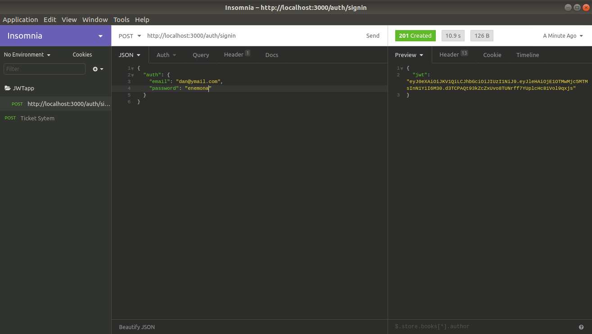
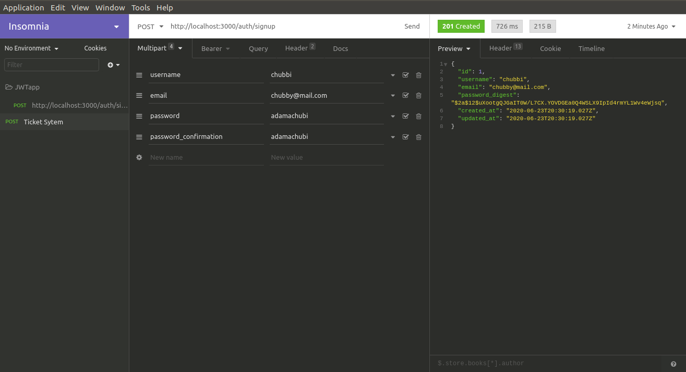

# Knock as an authentication solution for Rails API

### Background
Today I am going to give you detailed steps on how to get knock gem up and running in your Rails application. The idea for this article stems from the fact that I couldn't find a well-defined and up to date resource on how to implement rails API token authentication. For this tutorial, I will be using the latest version (6.0) of Ruby on Rails.
### Setup
First thing first let's generate a new Rails app:
````ruby 
$ rails new JWTapp --api -d=postgresql -T
$ cd JWTapp
$ rails db:create
$ rails db:migrate
````
### CORS
Let's uncomment Cors gem to permit access to the API:
````ruby 
gem 'rack-cors'
$ bundle install
````
````ruby 
Write the following in cors.rb :
# config/initializers/cors.rb
Rails.application.config.middleware.insert_before 0, Rack::Cors do
 allow do
    origins 'http://localhost:3000'
    resource '*',
    headers: :any,
    methods: [:get, :post, :put, :patch, :delete, :options, :head]
 end
end
````

### Bcrypt & Knock Gem
Bcrypt is a hash algorithm for password hashing and Knock which is mainly for JWT authentication.
````ruby 
gem 'bcrypt'
gem 'knock'
````
Let's run
````ruby 
$ bundle install
````
### User Model & Controllers
Now we are going to create a user using the scaffold generator.
````ruby 
$ rails generate scaffold User username:string email:string password_digest:string
````
### Include this in your user model.
````ruby 
# app/models/user.rb 
class User < ApplicationRecord
   has_secure_password
   validates :username, presence: true
   VALID_EMAIL_REGEX = /\A[\w+\-.]+@[a-z\d\-]+(\.[a-z\d\-]+)*\.[a-z]+\z/i.freeze
   validates :email, presence: true,uniqueness: true, format: { with: VALID_EMAIL_REGEX }
end
````
The user controller generated by the scaffold gave us a field called password_digest. But Bcrypt, in addition to hashing the password, it also turns password_digest into two fields, password and password_confirmation. So we need to change the permitted params from password_digest to these two fields.
````ruby 
# app/controllers/users_controller.rb
def user_params
 params.permit(:username, :email, :password, :password_confirmation)
end
````
Let's remove the 'location: @user' in the create method.
````ruby 
# app/controllers/users_controller.rb
def create
   @user = User.new(user_params)
if @user.save
     render json: @user, status: :created
   else
     render json: @user.errors, status: :unprocessable_entity
   end
 end
 ````
Migrate data by running.
````ruby 
$ rails db:migrate
````
Let's create a user using the rails console.
````ruby 
$ rails c
````
````ruby 
User.create(username: "Danny", email: "dan@ymail.com", password: "enemona", password_confirmation: "enemona")
````
### Knock Configuration
Now let's configure the knock Gem.
````ruby 
$ rails g knock:install
````
This will create an initializer file at config/initializers/knock.rb that contains the default configuration.
Yeah, I know you got an error like this: Could not load generator "generators/knock/install_generator", if not skip to the next step(default knock token), this is caused by Zeitwerk that is rails 6 autoloader.we can circumnavigate this error by switching the autoloader. Read more about Zeitwerk [here].
Now we are going to degenerate the knock and generate it once more, once we have included the line below into application.rb.
````ruby 
$ rails d knock:install
````
Let's include this in application.rb file
````ruby 
# config/application.rb 
config.load_defaults 6.0 and config.autoloader = :classic
````
````ruby 
$ rails g knock:install
````
By default, knock token is set to expire in 24 hours, we can adjust it if we uncomment the line below, and adjust it however we want.
````ruby 
# config/initializers/knock.rb 
config.token_lifetime = 1.day
````
Generate a controller for users to sign in through:
````ruby 
$ rails generate knock:token_controller user
````
This generates a controller called user_token_controller. It inherits from Knock::AuthTokenController which comes with a default create action that will create a JWT when signed in.
Note: user_token_controller is meant for sign in and it's different from users_controller.
````ruby 
# app/controllers/user_token_controller.rb
class UserTokenController < Knock::AuthTokenController
end
````
The generator also inserts a route in the routes.rb file as an API endpoint for sign in.
````ruby 
# app/config/routes.rb
post 'user_token' => 'user_token#create'
````
Now let's insert include Knock::Authenticable module in your application_controller file.
````ruby 
# app/controllers/application_controller.rb 
class ApplicationController < ActionController::API
 include Knock::Authenticable
end
````
You almost there friend, add an authenticate_user before filter to your controllers to be protected, here I am going to first add it to users_controller and exempt the create method in order to enable users to sign up.
````ruby 
# app/controllers/users_controller.rb 
before_action :authenticate_user,except: [:create]
````
If you are using Rails 5.2 or higher you need to take two more steps.
First, since protect_from_forgery is included in ActionController::Base by default, now you need to skip that in the Knock controller we generated for logging in from our Front-end. Since we're treating the back-end as an API, we should disable the standard Rails authenticity token.
````ruby 
# app/controllers/user_token_controller.rb
class UserTokenController < Knock::AuthTokenController
 skip_before_action :verify_authenticity_token, raise: false
end
````
Lastly, Rails no longer uses config/secrets.yml to hold the secret_key_base that is used for various security features, including generating JWTs with the Knock gem. Rails now use an encoded file called config/credentials.yml.enc. 
Add the below line to the Knock configuration file.
````ruby 
# config/initializers/knock.rb 
config.token_secret_signature_key = -> { Rails.application.credentials.secret_key_base }
````
### Current_user
You also have access directly to current_user.
````ruby 
def index
 if current_user
  # do something
 else
  # do something else
 end
end
````
### Routes
Add an API namespace using scopes, This time let's add an "auth/" scope to all of our API routes. That will add "auth" to the path but not to the controller or model. I edited the default route to `user_token controller`.
````ruby 
# config/routes.rb 
scope '/auth' do
 post '/signin', to: 'user_token#create'
 post '/signup', to: 'users#create'
end
````
### Testing
Now let's test the API using Insomnia, but you can use Postman or Curl command-line tool.
Run the server, may the odds be ever in your favour.
$ rails s
The sign in details should be wrapped in auth, because it contains the sign-in form field names and values
````ruby 
{
 "auth": {
 "email": "dan@ymail.com",
 "password": "enemona"
 }
}
````
<p align="center">
  
</p>

### Bonus
Let's create a user through the sign-up endpoint.

<p align="center">
  
</p>

Thank you for reading. For more information regarding the resources implemented in this guide, please refer to:

https://github.com/nsarno/knock

Contact Information
[Twitter](https://twitter.com/_kobiyoyo)
[LinkedIn](https://www.linkedin.com/in/chubiyojo-adama/)
[Email](adamachubi@gmail.com)
